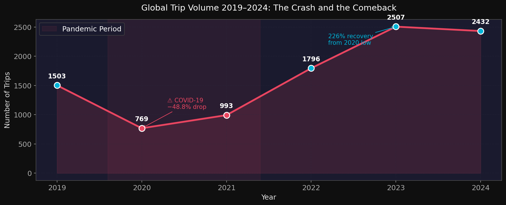
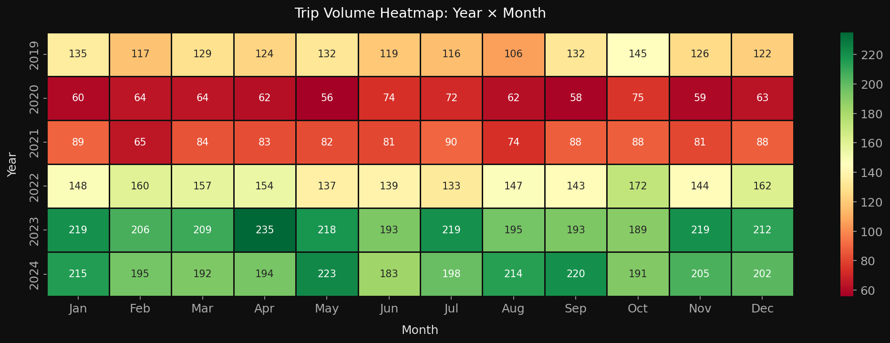
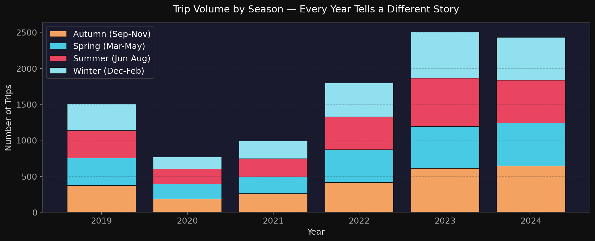
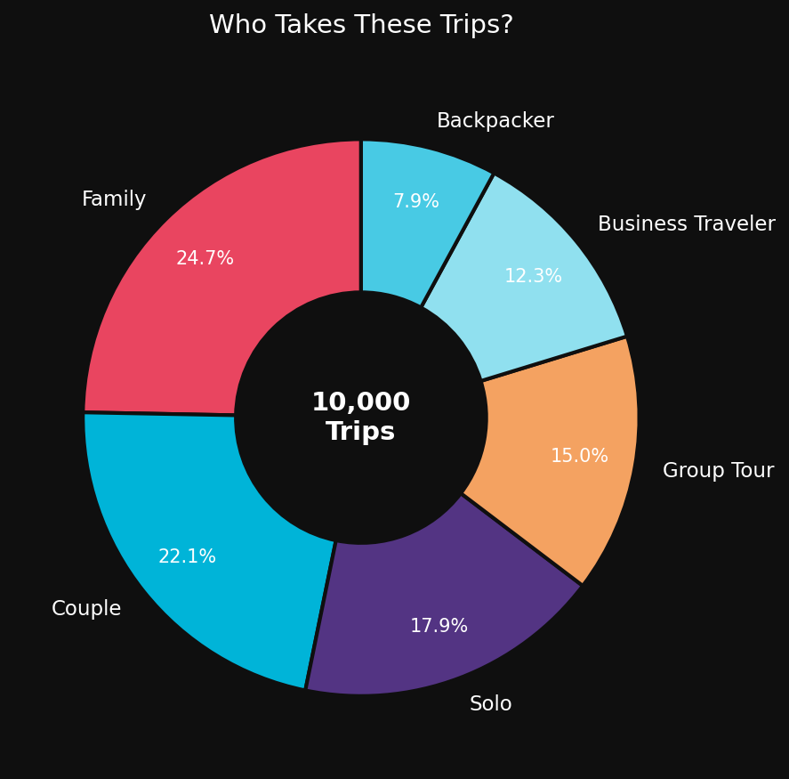
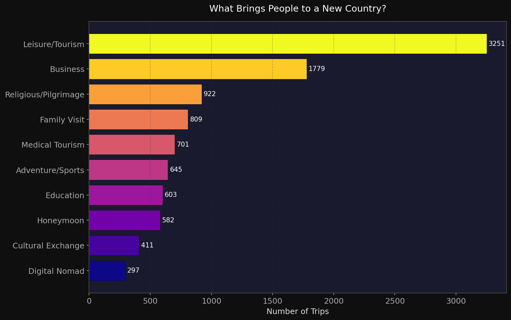
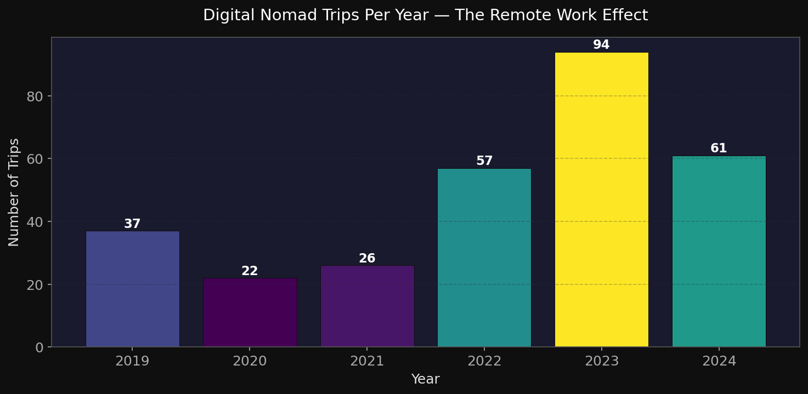
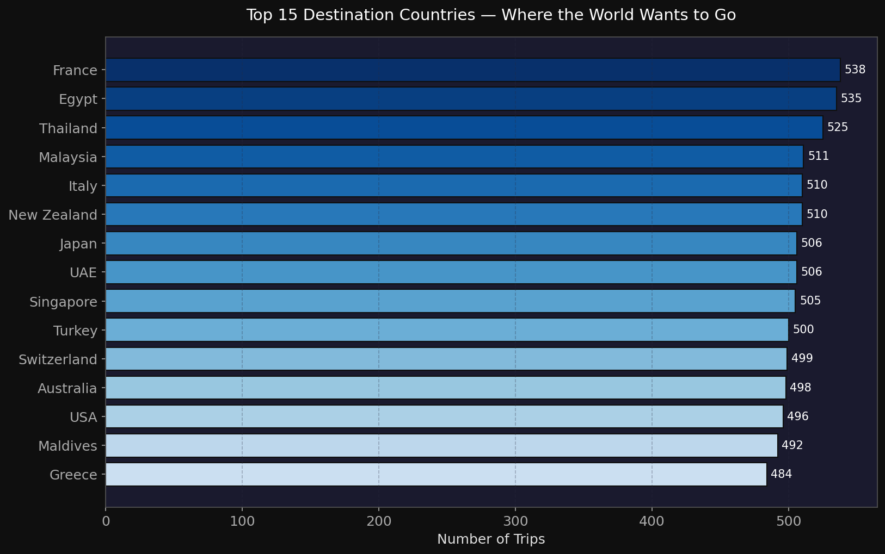
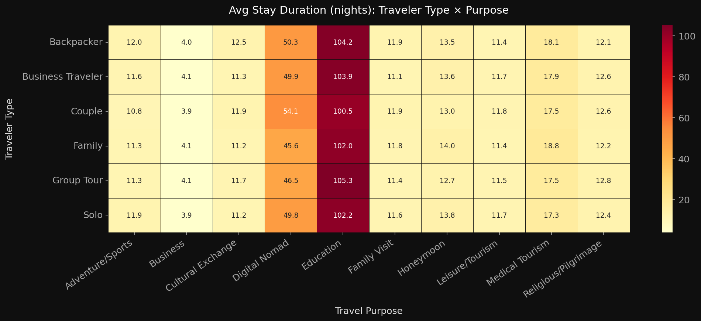

# 🌍 Where Did the World Go? — Global Travel Behavior & Trends (2019–2024)

[](https://www.python.org/)
[](https://pandas.pydata.org/)
[](https://plotly.com/)
[](https://seaborn.pydata.org/)
[](https://www.kaggle.com/zebamushtaq)
[](LICENSE)

> *10,000 trips. 6 years. 1 pandemic. And a recovery nobody saw coming quite like this.*

This project analyzes a synthetic global tourism dataset to tell the real story behind where the world traveled — and stopped traveling — between 2019 and 2024. It's not just charts. It's a full data narrative covering the pre-pandemic baseline, the COVID collapse, and the patterns that emerged on the other side.

---

## 📊 Key Visualizations

### 1. The Crash and the Comeback

Travel dropped **48.8% in a single year** (2019→2020). By 2023, it had grown **226% from the 2020 low** — surpassing pre-pandemic levels entirely.



---

### 2. When Does the World Travel?

The pandemic hit every month equally. But the recovery wasn't uniform — some months bounced back faster than others.



---

### 3. Season-by-Season Breakdown

Summer edges out other seasons consistently, but the spread is narrower than you'd expect. People travel year-round.



---

### 4. Who Actually Takes These Trips?

Families make up 25% of all trips — every single year, through the pandemic and out the other side. The most consistent traveler segment in the dataset.



---

### 5. Why Do People Travel?

Leisure/Tourism leads by a wide margin. But the more interesting story is in the smaller categories — Digital Nomads, Medical Tourism, Religious travel — and how they shifted.



---

### 6. The Remote Work Effect

Digital Nomad trips more than doubled between 2021 and 2023. Borders stayed open for laptops even when they didn't for tourists.



---

### 7. Top Destination Countries

France, Egypt, Thailand, Malaysia, New Zealand — the top 5 destinations are spread across 4 different continents. Global tourism is genuinely global.



---

### 8. Who Stays Longest?

The median trip is 11 nights. The mean is 17.5. Group Tours and Business Travelers pull that average up significantly.



---

## 📌 Project Overview

**Dataset:** Synthetic global tourism data — 10,000 trip records, 2019–2024  
**Columns:** trip_id, year, month, season, origin_country, destination_country, travel_purpose, traveler_type, num_travelers, duration_nights

> ⚠️ This is a **synthetic dataset** built to reflect realistic global tourism patterns. It does not represent official tourism statistics.

---

## 🔍 Key Findings

- Travel volume fell **48.8%** from 2019 to 2020 — the steepest single-year drop in the dataset
- Recovery was not linear: 2021 was still 34% below 2019 levels before the real rebound in 2022
- **Families** are the most consistent traveler segment — 25% of trips every year regardless of disruptions
- **Digital Nomad** travel grew 261% from 2021 to 2023, reflecting the shift to remote work
- **Pakistan** appears in the top 10 origin countries with 496 outbound trips — one of the stronger South Asian representations in the data
- France, Egypt, and Thailand are the top 3 destinations — consistent across all 6 years
- The median vs mean gap in trip duration (11 vs 17.5 nights) is driven by Group Tours and Business Travelers who commit to longer stays

---

## 🛠️ Tech Stack

| Tool | Use |
|---|---|
| Python 3.10+ | Core language |
| Pandas | Data loading, cleaning, aggregation |
| Matplotlib | Static chart rendering |
| Seaborn | Heatmaps and statistical plots |
| Plotly | Interactive charts in notebook |
| Jupyter Notebook | Full EDA narrative |

---

## 📁 Repository Structure

```
travel-behavior-trends-analysis/
│
├── data/
│   └── global_tourism_travel_trends-selected-columns.csv
│
├── notebooks/
│   └── travel_trends_eda.ipynb        # Full story-driven EDA
│
├── images/
│   ├── 01_yearly_trend.png
│   ├── 02_heatmap_month_year.png
│   ├── 03_traveler_type_donut.png
│   ├── 04_travel_purpose.png
│   ├── 05_top_destinations.png
│   ├── 06_digital_nomad.png
│   ├── 07_duration_heatmap.png
│   └── 08_season_trend.png
│
├── requirements.txt
├── LICENSE
└── README.md
```

---

## 🚀 How to Run

```bash
git clone https://github.com/Zeba-Mushtaq/travel-behavior-trends-analysis.git
cd travel-behavior-trends-analysis
pip install -r requirements.txt
jupyter notebook notebooks/travel_trends_eda.ipynb
```

---

## 🔮 What's Next

- Time-series forecasting of travel demand (Prophet / ARIMA)
- K-Means clustering to segment travelers into behavioral profiles
- Streamlit dashboard for interactive exploration
- Geographic flow mapping of origin → destination routes

---

## 👩‍💻 Author

**Zeba Mushtaq** — Data Analyst · AI/ML · Building in Public

[](https://zeba-portfolio.vercel.app)
[](https://github.com/Zeba-Mushtaq)
[](https://zebabuilds.hashnode.dev)
[](https://dev.to/zebamushtaq)
[](https://medium.com/@zebamushtaq)

---

## 📄 License

[MIT License](LICENSE)
